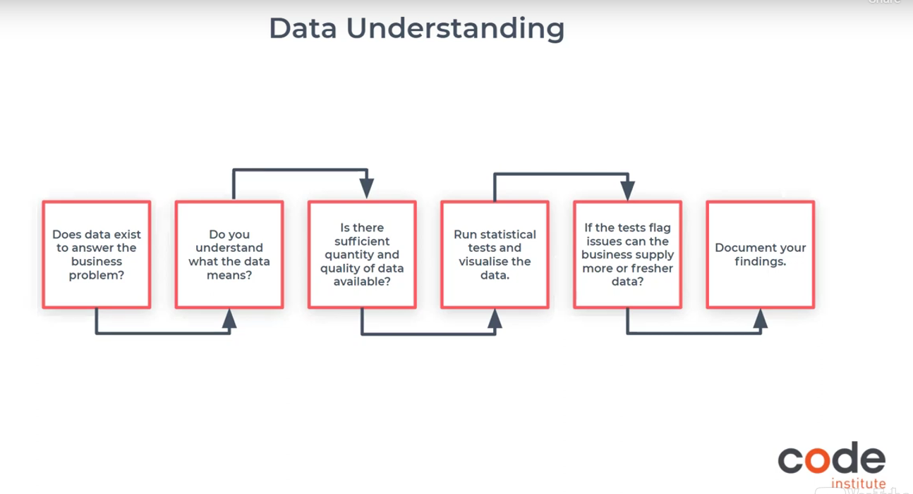
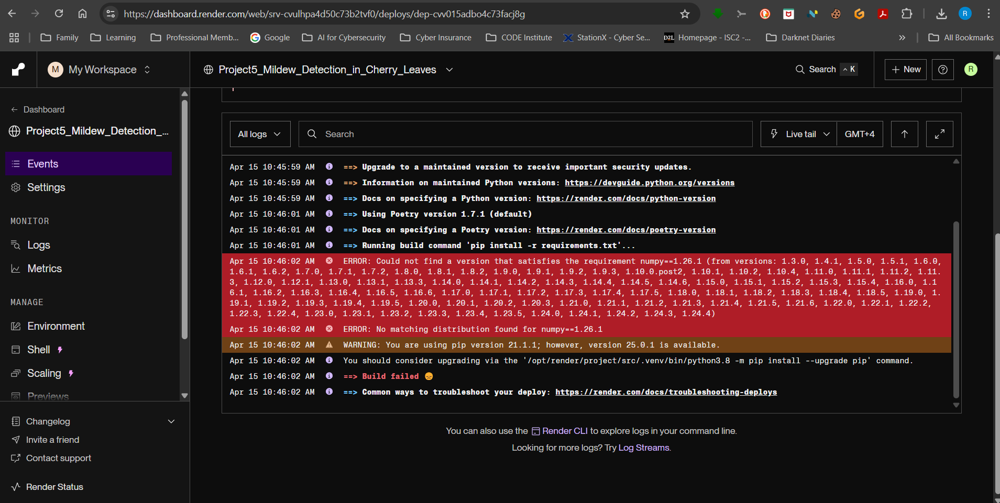

# 

## Template Instructions

Welcome,

This is the Code Institute student template for the Cherry Leaves project option in Predictive Analytics. We have preinstalled all of the tools you need to get started. It's perfectly okay to use this template as the basis for your project submissions. Click the `Use this template` button above to get started.

You can safely delete the Template Instructions section of this README.md file and modify the remaining paragraphs for your own project. Please do read the Template Instructions at least once, though! It contains some important information about the IDE and the extensions we use.

## How to use this repo

1. Use this template to create your GitHub project repo

1. In your newly created repo click on the green Code button. 

1. Then, from the Codespaces tab, click Create codespace on main.

1. Wait for the workspace to open. This can take a few minutes.

1. Open a new terminal and `pip3 install -r requirements.txt`

1. Open the jupyter_notebooks directory, and click on the notebook you want to open.

1. Click the kernel button and choose Python Environments.

Note that the kernel says Python 3.12.1 as it inherits from the workspace, so it will be Python-3.12.1 as installed by Codespaces. To confirm this, you can use `! python --version` in a notebook code cell.

## Cloud IDE Reminders

To log into the Heroku toolbelt CLI:

1. Log in to your Heroku account and go to _Account Settings_ in the menu under your avatar.
2. Scroll down to the _API Key_ and click _Reveal_
3. Copy the key
4. In the terminal, run `heroku_config`
5. Paste in your API key when asked

You can now use the `heroku` CLI program - try running `heroku apps` to confirm it works. This API key is unique and private to you, so do not share it. If you accidentally make it public, then you can create a new one with _Regenerate API Key_.

## Dataset Content

- The dataset is sourced from [Kaggle] https://www.kaggle.com/codeinstitute/cherry-leaves. We then created a fictitious user story where predictive analytics can be applied in a real project in the workplace.
- The dataset contains +4 thousand images taken from the client's crop fields. The images show healthy cherry leaves and cherry leaves that have powdery mildew, a fungal disease that affects many plant species. The cherry plantation crop is one of the finest products in their portfolio, and the company is concerned about supplying the market with a compromised quality product.

## Business Requirements

The cherry plantation crop from Farmy & Foods is facing a challenge where their cherry plantations have been presenting powdery mildew. Currently, the process is manual verification if a given cherry tree contains powdery mildew. An employee spends around 30 minutes in each tree, taking a few samples of tree leaves and verifying visually if the leaf tree is healthy or has powdery mildew. If there is powdery mildew, the employee applies a specific compound to kill the fungus. The time spent applying this compound is 1 minute. The company has thousands of cherry trees located on multiple farms across the country. As a result, this manual process is not scalable due to the time spent in the manual process inspection.

To save time in this process, the IT team suggested an ML system that detects instantly, using a leaf tree image, if it is healthy or has powdery mildew. A similar manual process is in place for other crops for detecting pests, and if this initiative is successful, there is a realistic chance to replicate this project for all other crops. The dataset is a collection of cherry leaf images provided by Farmy & Foods, taken from their crops.

- The client is interested in conducting a study to visually differentiate a healthy cherry leaf from one with powdery mildew
- The client is interested in predicting if a cherry leaf is healthy or contains powdery mildew.

## Hypothesis and how to validate?

  ## Project Hypothesis
  1. The goal of the client was to make sure that they do not supply the market with a product of compromised quality 
  2. During our business assessment phase we understood that using conventional data analysis, it was possible to conduct a study to visually differentiate a cherry leaf that is healthy from one that contains powdery mildew.
  3. The client had two clear business requirements.
      -   Conduct a study to visually differentiate a cherry leaf that is healthy from one that contains powdery mildew.
      -   Predict if a cherry leaf is healthy or contains powdery mildew.
  4. The client wants a dashboard that provides both a non-technical and technical output
  ## Approach for Validation
  1. The machine learning pipeline is a sequence of operations that are performed when training a machine learning model. 
  -   We complete the following tasks in the three Jupyter notebooks configured for this repo.
      -   Data Collection:  
      -   Data Cleaning or Correcting
      -   Feature Engineering ( We mention this here as there is an overlap of some tasks between feature engineering and Data Cleaning)
      -   Data Augmentation- Convolution networks struggle to find patterns when the dataset is very limited.
      -   We then split the data in train, test and validation sets.
      -   We trained the data, test the output ad then validated the same 
      -   Convolutional neural network (CNN) model are more modern but computational heavy update to Artificial Neural Networks. As our dataset was images , this was a natural choice.
      -   Tensor flow a popular Python package using the Sequential Model function to model Neural Networks using different layers was deployed.
      -   Due to its effectiveness and syntax simplicity, another neural network library, known as Keras, was adopted as the interface for TensorFlow from version 2.0.
      -   A Dropout layer is a regularization layer and is used to reduce the chance of **overfitting** the neural network.
      -   With machine learning models we want to analyze the performance of the model over a test set of data that the ML model has not seen at the
          time of training. This performance analysis is called the generalization of the model.
      -   If we get the desired generalized performance, we take these models further for the deployment, otherwise we go for the optimization process

## The rationale to map the business requirements to the Data Visualisations and ML tasks

- List your business requirements and a rationale to map them to the Data Visualisations and ML tasks.

## ML Business Case Assessment 

Marianne McGuineys, a fictional individual, is the head of IT and Innovation at Farmy & Foods, a company in the agricultural sector that produces and harvests different types of food. Recently, she is facing a challenge where their cherry plantations have been presenting powdery mildew, which is a fungal disease that affects a wide range of plants.

**Business Issue**: 
- The cherry plantation crop is one of their finest products in the portfolio and the company is concerned about supplying the market with a product of compromised quality.
  
**Client Benefit**
- The client will not supply the market with a product of compromised quality.

**Goal** : 
- The manual process in place today is not scalable due to time spent in inspection.
- To save time in this process, the IT team suggested an ML system that is capable of detecting instantly, using a tree leaf image, if it is healthy or has powdery mildew.

- **Business requirement 1**
  - 1 Difference between average and variability image for each class ( healthy and powdery mildew)
  - 2 The differences between average healthy and average powdery mildew cherry leaves
  - 3 An image montage for each class.
- **Business requirement 2** 
  - Deliver an ML system that is capable of predicting whether a cherry leaf is healthy or contains powdery mildew.

## Answer questions realted to the Business Assessment 

1. What are the business requirements?
   - The client is interested in conducting a study to visually differentiate a cherry leaf that is healthy from one that contains powdery mildew.
   - The client is interested in predicting if a cherry leaf is healthy or contains powdery mildew.
2. Is there any business requirement that can be answered with conventional data analysis?
   - Yes, we can use conventional data analysis to conduct a study to visually differentiate a cherry leaf that is healthy from one that contains powdery mildew.
3. Does the client need a dashboard or an API endpoint?
   - The client needs a dashboard.
4. What does the client consider as a successful project outcome?
   - A study showing how to visually differentiate a cherry leaf that is healthy from one that contains powdery mildew.
   - Also, the capability to predict if a cherry leaf is healthy or contains powdery mildew.
5. Can you break down the project into Epics and User Stories?
   - Information gathering and data collection.
   - Data visualization, cleaning, and preparation.
   - Model training, optimization and validation.
   - Dashboard planning, designing, and development.
   - Dashboard deployment and release.
6. Ethical or Privacy concerns?
   - The client provided the data under an NDA (non-disclosure agreement), therefore the data should only be shared with professionals that are officially involved in the project.
7. Does the data suggest a particular model?
   - The data suggests a binary classifier, indicating whether a particular cherry leaf is healthy or contains powdery mildew.
8. What are the model's inputs and intended outputs?
   - The input is a cherry leaf image and the output is a prediction of whether the cherry leaf is healthy or contains powdery mildew.
9. What are the criteria for the performance goal of the predictions?
   - We agreed with the client a degree of 97% accuracy.
10. How will the client benefit?
    - The client will not supply the market with a product of compromised quality.
  
## Dashboard Design (Streamlit App User Interface)

### Page 1: Executive_Project Summary

#### General Information

Marianne McGuineys, a fictional individual, is the head of IT and Innovation at Farmy & Foods, a company in the agricultural sector that produces and harvests different types of food. Recently, she is facing a challenge where their cherry plantations have been presenting powdery mildew, which is a fungal disease that affects a wide range of plants.

The cherry plantation crop is one of their finest products in the portfolio and the company is concerned about supplying the market with a product of compromised quality.

Currently, the process is to manually verify if a given cherry tree contains powdery mildew. An employee spends around 30 minutes in each tree, taking a few samples of tree leaves and verifying visually if the leaf tree is healthy or has powdery mildew. If it has powdery mildew, the employee applies a specific compound to kill the fungus. The time spent applying this compound is 1 minute. The company has thousands of cherry trees located in multiple farms across the country. As a result, this manual process is not scalable due to time spent in the manual process inspection.

To save time in this process, the IT team suggested an ML system that is capable of detecting instantly, using a tree leaf image, if it is healthy or has powdery mildew. A similar manual process is in place for other crops for detecting pests, and if this initiative is successful, there is a realistic chance to replicate this project to all other crops. The dataset is a collection of cherry leaf images provided by Farmy & Foods, taken from their crops.

#### The business requirements are:

- The client is interested in conducting a study to visually differentiate a cherry leaf that is healthy from one that contains powdery mildew.
- The client is interested in predicting if a cherry tree is healthy or contains powdery mildew.

#### Deliverables 

- Deliver a dashboard that meets the above requirements.

### Page 2: Cherry_leaves_Visualizer

* It will answer business requirement 1
   - Checkbox 1 - Difference between average and variability image for each class ( healthy and powdery mildew)
   - Checkbox 2 - The differences between average healthy and average powdery mildew cherry leaves
   - Checkbox 3 - An image montage for each class.

### Page 3: Mildew_Powdery_Detection

- It will answer business requirement 2 information.
  - "An ML system that is capable of predicting whether a cherry leaf is healthy or contains powdery mildew."
- A link to download a set of cherry leaf images for live prediction (https://www.kaggle.com/datasets/codeinstitute/cherry-leaves).
- A User Interface with a file uploader widget. 
- The user should have the capacity to upload multiple images. 
- For each image, it will display the image and a prediction statement, indicating if a cherry leaf is healthy or contains powdery mildew and the probability associated with this statement.
- A table with the image name and prediction results, and 
- A download button to download the table.
  

### Page 4: Project_Hypothesis_Validation

- This is explained in detail in the section above - **Hypothesis and how to validate?**
  
### Page 5: Project_Performance_Metrics

- Label Frequencies for Train, Validation and Test Sets
- Model History - Accuracy and Losses
- Model evaluation result
  

# MACHINE LEARNING PIPELINE

- A typical workflow used for supervised learning is: 
  - Split the dataset into train and test set
  - Fit the model (either using a pipeline or not)
  - Evaluate your model. 
- If performance is not good,revisit the process, 
  - start from data collection
  - Conduct EDA (Exploratory Data Analysis) etc.
  - The Machine learning pipeline can be broken down into three sections as can be seen in the image below.These sections are also used when creating the three Jupyter notebooks
  

# INFRASTRUTURE TOOLS AND TECHNOLOGIES

- Programming Language - Python 
- Cloud IDE ( for ediotrs and sourcee control )- We use Github and Jupyter.
- loud IDE help us in the CRISP-DM process to complete Data colelction, Visualization, Cleaning along with Model training and evolution into a Jupyter Notebook 
- Dashboard : Streamlit
- Cloud Hosting - Heroku or Render
- Kaggle - This is the location for the images dataset provide by the client 
  - [Kaggle] https://www.kaggle.com/codeinstitute/cherry-leaves 
- Python Data Analysis Packakges: Captured in the Requirements.txt file and imported inside the Jupyter notebooks
  - numpy==1.26.1
  - pandas==2.1.1
  - matplotlib==3.8.0
  - seaborn==0.13.2
  - plotly==5.17.0
  - Pillow==10.0.1
  - streamlit==1.40.2
  - joblib==1.4.2
  - scikit-learn==1.3.1
  - tensorflow-cpu==2.16.1
  - keras>=3.0.0
 -  Convolutional neural network (CNN) model are more modern but computational heavy update to Artificial Neural Networks. 
    -  A Convolution Neural Netowrk is commonly used for image processing and computer vision.
    -  As our dataset was images , this was a natural choice.
    -  Deep Neural Networks have two properties namely **BIAS** and **BACKPROPOGATIO** due to which we do not have to spend a lot of time doing feature engineering for data. 
- These two functions are used in TensorFlow as **OPTIMIZER** and **LOSS FUNCTIONS**.
    - Tensor flow a popular Python package using the Sequential Model function to model Neural Networks using different layers was deployed.
    - Due to its effectiveness and syntax simplicity, another neural network library, known as Keras, was adopted as the interface for TensorFlow from version 2.0.
    - A Dropout layer is a regularization layer and is used to reduce the chance of **overfitting** the neural network.
    - TensofrFlow Loass and Optimzation 
  
   

  - Cloudbased IDE used for this project 
  
  
  
# CRISP-DM

- CRISP-DM is the Cross Industry  Standard Process for Data Mining. 
- Through this project we have used this standard while building our three Jupyter notebooks.
  - DataCollection Notebook 
  - DataVisualization Notebook
  - Modelling and Evaluation Notebook
- The CRISP-DM model and the different steps of the model are capture in the images below 
  
  
   
- Business Understanding 
  
 

- Data Understanding
  

- Data Preparation
  
 

- Modelling
  
 

# DATA COLLECTION NOTEBOOK 

- Data Collection is part of the Data Understanding Step of the CRISP-DM Methodology . 

### Objectives

* Fetch data from Kaggle dataset . The datasource for this project has been provided by cCode institute at https://www.kaggle.com/datasets/codeinstitute/cherry-leaves in the form a zip file 
* Extract the Zip file , and prepare it for further Machine Learning analysis 
* Save the file in out/dataset/ folder and push it to the repo 
  

### Inputs

* The input for this notebook is a Kaggle dataset from Code Insittute at https://www.kaggle.com/datasets/codeinstitute/cherry-leaves
* This zip file is saved and extracted at input/datase/cherry_leaves/folder 
* There are Two  file folders- Healthy and Power_mildew

### Outputs

* The output will stored in the output/dataset folder and pushed to the gitpod repo.  

### Additional Comments

* Data Collection is part of the Data Understanding section of the CRISP-DM methodology.
* This is the second most important step of the CRISP-DM methodology after understanding the business requirements. 

# DATA VISUALIZATION NOTEBOOK 

### Objectives

* This note book helps meet the clients business requirements 1 as listed below  
  - Average images and variability images for each class (healthy or powdery mildew). 
    - In general the mean and standard deviation is called avergae and variablity. 
    - This will help us meet the Checkbox 1 of Page 2 on our Steamlit Dashboard App
  - The differences between average healthy and average powdery mildew cherry leaves. 
    - This will help us meet the Checkbox 2 of Page 2 on our Steamlit Dashboard App. 
    - We can see three images - Average healthy, Avergae Powdery and Difference in healthy and powdery
  - An image montage for each class - healthy and Powdery Mildew cherry leaves
    - In the Streamlit Dasboard app under Page 2 the client can select a labeel - Healthy or Powdery Mildew
    - This will allow the client to create a montage of ramdom pro-labelled images from the selected images for the selected label.
    - Every time the client clicks the **Create Montage** button, it generates a new montage of random images 
  

### Inputs

* The input for this notebook from the test, train and vaidation datasets created in the DataColelction notebook under the below directories
  - Train Dataset - /workspaces/Project5_Mildew_Detection_in_Cherry_Leaves/input/dataset/cherry-leaves/train
  - Test Dataset - /workspaces/Project5_Mildew_Detection_in_Cherry_Leaves/input/dataset/cherry-leaves/test
  - Validate Dataset - /workspaces/Project5_Mildew_Detection_in_Cherry_Leaves/input/dataset/cherry-leaves/validation
  

### Outputs

* The output will as below 
  - Image shape embedding pickle file 
  - Mean and Variability of imagess per label plot 
  - Plot to distinguish contrast between parasite-contained and uninfected cell images
  - Generate code that answers business requirement 1 and can be used to build image montage on Streamlit dashboard

### Importance of this notebook

  - This exercise is important to visually differentiate images of one class from another.
  - data visualization for image data is usually limited to creating animage montage to visually differentiate between different pre-labeled images.
  - Understanding the statistical difference between the mean and variability of the images of different classes helps you to anticipate the quality of data for model training.

# MODELLING AND EVALUATION NOTEBOOK 

### Objectives

* This note book helps meet the clients business requirements 2 as listed below  
  - The client is interested in predicting if a cherry leaf is healthy or contains powdery mildew.

### Inputs

* The input for this notebook from the test, train and vaidation datasets created in the DataColelction notebook under the below directories
  - Train Dataset - /workspaces/Project5_Mildew_Detection_in_Cherry_Leaves/input/dataset/cherry-leaves/train
  - Test Dataset - /workspaces/Project5_Mildew_Detection_in_Cherry_Leaves/input/dataset/cherry-leaves/test
  - Validate Dataset - /workspaces/Project5_Mildew_Detection_in_Cherry_Leaves/input/dataset/cherry-leaves/validation
  - image shape embeddings
  

### Outputs

* The output will as below 
  - Images distribution plot in train, validation, and test set 
  - Image augmentation 
  - Class indices to change prediction inference in labels
  - Machine learning model creation and training
  - Save model
  - Learning curve plot for model performance 
  - Model evaluation on pickle file
  - Prediction on the random image file

### Importance of this notebook

  - Image augmentation increases the training image data by artificially and temporarily creating training images through different processes,
or a combination of multiple processes, such as random rotation, shifts, shear, and flips, etc, in the computer’s short term memory.

- Data Augmentation Image 
  

- Choice of the Algorithm 

- Overfitting Model 
  

## Unfixed Bugs

- A lot of issues was encountered while working on this project.
- The Walkthrough project and code is built on python 2.8 and the code institite template has 3.12 as the latest version.
- While deploying to Heroku, the slug was over 500 MB which prevented from deploying on Heroku with all relevant files and libraries.
- In order to deploy on Heroku many deletions were made 
  - streamlit==1.40.2
  - Pillow==10.0.1
  - numpy==1.26.1
  - tensorflow-cpu==2.16.1
  - matplotlib==3.8.0
  - pandas==2.1.1
  - seaborn==0.13.2
  - The input directories which inlcude the test, train and validation sets were deleted to reduce the slug file size. 
  - As such the Heroku app deployed does not have the input/validation files which are need to display some features on the streamlit app. 
- When this issue was raised to the tutor, they acknolwedged this problem and requested to change to Render. 
- A screenshot of the issue with Heroku.
  
   

-The Deployment on Render also did not happen as it kep giving errors for Pandas and other packages.
  - We used a lower version of Numpy than what was in my original requirements.txt file , deleted Procfile and runtime.txt files and used a Python version of 3..8.12 as outlined in the code institue deployment guide.

- Render Deploy issues 
  
  
   
## The ORGINAL INPUT Files have been erased to meet Project Deadline to submit this project. As such some of the STREAMLIT features dont work from HEROKU. BUT the same can be seen once the DataCollection Notebook is run again and the command **streamlit run app.py** is run from the visual studio console

## Deployment

1. The Heroku site has a limitation of 500MB on the slug file. 
2. Code Institute also suggests using an alternate site called Render.com https://dashboard.render.com/web/new
3. Deployment guide for Render https://code-institute-students.github.io/deployment-docs/42-pp5-pa/

### Heroku

- The App live link is: `https://YOUR_APP_NAME.herokuapp.com/`
- Set the runtime.txt Python version to a [Heroku-20](https://devcenter.heroku.com/articles/python-support#supported-runtimes) stack currently supported version.
- The project was deployed to Heroku using the following steps.

1. Log in to Heroku and create an App
2. At the Deploy tab, select GitHub as the deployment method.
3. Select your repository name and click Search. Once it is found, click Connect.
4. Select the branch you want to deploy, then click Deploy Branch.
5. The deployment process should happen smoothly if all deployment files are fully functional. Click the button Open App on the top of the page to access your App.
6. If the slug size is too large, then add large files not required for the app to the .slugignore file.

## Main Data Analysis and Machine Learning Libraries

- All details are captured under relevant sections of each jupyter notebook 
- Python Data Analysis Packakges: Captured in the Requirements.txt file and imported inside the Jupyter notebooks
  - numpy==1.26.1
  - pandas==2.1.1
  - matplotlib==3.8.0
  - seaborn==0.13.2
  - plotly==5.17.0
  - Pillow==10.0.1
  - streamlit==1.40.2
  - joblib==1.4.2
  - scikit-learn==1.3.1
  - tensorflow-cpu==2.16.1
  - keras>=3.0.0
 -  Convolutional neural network (CNN) model are more modern but computational heavy update to Artificial Neural Networks. 
    -  A Convolution Neural Netowrk is commonly used for image processing and computer vision.
    -  As our dataset was images , this was a natural choice.
    -  Deep Neural Networks have two properties namely **BIAS** and **BACKPROPOGATIO** due to which we do not have to spend a lot of time doing feature engineering for data. 
      - These two functions are used in TensorFlow as **OPTIMIZER** and **LOSS FUNCTIONS**.
    - Tensor flow a popular Python package uses the Sequential Model function to model Neural Networks using different layers was deployed.
    - Due to its effectiveness and syntax simplicity, another neural network library, known as Keras, was adopted as the interface for TensorFlow from version 2.0.
    - A Dropout layer is a regularization layer and is used to reduce the chance of **overfitting** the neural network.
    - TensofrFlow Loass and Optimzation 
    - Convolution Model Screenshot
  
  
  
  ## Model creation

  
  - The client is interested in predicting if a cherry leaf is healthy or contains powdery mildew. 
  - This will also help us populate the **Page 3: mildew_powdery_detection** of our Streamlit Dashboard App.
  - When need to Predict a Category , we use the ML task of Classification.
  - In our project, we need to classify images, which is unstructured , so we use Convolutional Neural Network.
  - Convolutional Neural Network which is more modern and computational heavy,an update to the artificial neural networks.
  - The convolutional neural network consists of convolutional layers before the deep neural layers.
  - Deep learning just refers to many layers of nodes inside a Convolutional Neural Network (CNN).     
  - The image augmentation process makes our model ready for the real-time implementation of the systems.
  - It also increases our model performance while training, via increasing the number of different combinations of pattern images in the memory of the computer.
  - We will use the python library TesnorFlow to build and train our own deep learning model for this project.
   - In our project, our CNN model will learn from the **dominant feature** of the pre-labeled cell images of our cherry leaves data
   - In our project, the dominant feature is the **Mildew** in the cherry leaf image.
   - The human behavior of **“learning from our mistakes”** inspires the optimizer and loss function mechanisms in deep neural networks.
   - Scientists have used this principle and mathematically created an algorithm to reduce error by using **optimizers and loss functions**. 
  -Futher details are captured under each section in the Modelling and Evaluation Jupyter Notebook.

  # Streamlit APP Dashboard

  Screenshots of the five pages created on the Streamlit App Dashboard for the client as per their requirement 1 and 2 

  - This is the first page and captures the executive sumamry for the client . This is for non technical users.
    
 

  - This is the page 2 and captures the Requirements 1
  
 

  - 

  - This is the page 3 and captures the Requirements 2  

 

  - Healthy Leaf

   

   - Mildew Powdery - Fungal Infection
  
   

  - This is the page 4 and outlines the project hypothesis 
  
 ![streamlit_project_hypothesis]](Readme.doc/streamlit_project_hypothesis.png)

  - This is last page ans show the ML model performance 
   
 

## Credits

  1. A lot of credit goes to Gyan Shashwat,for his wonderful explaination in Walkthrough Project 1- malaria Detector 
  2. Neil and Fernando Doritu also did a fantastic course explaining the concepts through the learing modules. 
  3. My mentor Rohit Sharma was very gracious to come on calls after a tiring day and short notices to accomode my requests.
  4. The code was  sourced and heavily influenced by Gyan Shashwat through his Walkthrough project 1
  5. A lot of inspiration and guidance on Streamlit app buildup was taken from Jordon Fletorides a fellow student through his project link https://github.com/jflets/ml-mildew-detector/blob/main/app_pages/page_mildew_detection.py
  6. Pandas - https://pandas.pydata.org/pandas-docs/stable/user_guide/categorical.html
  7. Keras Augmentation : https://pyimagesearch.com/2019/07/08/keras-imagedatagenerator-and-data-augmentation/
  8. Deployment guide for Render https://code-institute-students.github.io/deployment-docs/42-pp5-pa/

### Content

  1.All Images in this Readme file are sourced from the lessons covered in the Predictive analytics course at Code Institute.

### Media

  1. All Images in this Readme file are sourced from the lessons covered in the Predictive analytics course at Code Institute.

## Acknowledgements 

  1. Lot of credit goes to Gyan Shashwat,for his wonderful explaination in Walkthrough Project 1- malaria Detector 
  2. Neil and Fernando Doritu also did a fantastic course explaining the concepts through the learing modules. 
  3. My mentor Rohit Sharma was very gracious to come on calls after a tiring day and short notices to accomode my requests.
